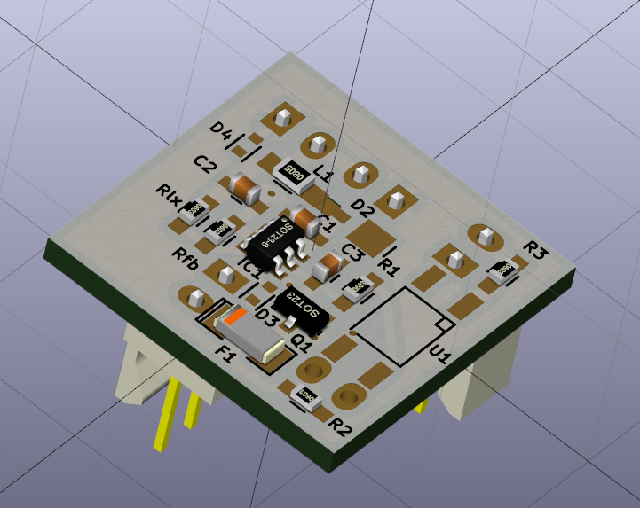

Wiilaserbar
=================

A driver board, case and holder for infrared lasers meant to replace the sensor bar of a Nintendo Wii. 

Be VERY CAREFUL in selecting the output power. Infrared lasers cannot be seen by the naked eye no matter the 
power. They can permanently damage your eyes even at less then 1mW!!! You might blind yourself in an instant!

This is a replacement for the Wii sensor bar. The populatd board powers two infrared laser diode modules. 
These in turn project infrared dots on a surface that the Wiimotes can pick up on just as they were standard
infrared diodes of the "sensor" bar. You can buy infrared laser diode modules on eBay or Aliexpress cheaply.
I used cheap 890nm modules from China said to emit 30mW (the output power with mine was exaggerated -
actually measured power at a university lab was ~2mW).

